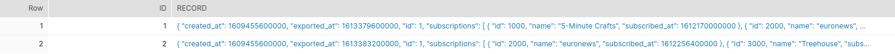
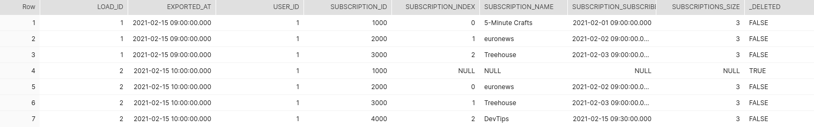

# Infer deletions within parent-child staging entries

This project presents a possible solution for inferring deletions within the parent-child staging 
data within an ELT pipeline.

Suppose that a video platform where the users can make channel subscriptions has a data pipeline 
to its Data Warehouse system for exporting in case of changes the data about its users.

Let us suppose for the sake of simplicity that the data exported towards the data warehouse
follows this format:

```
user
  - id: NUMBER
  - username: VARCHAR
  - created_at: DATETIME
  - exported_at: DATETIME
  
  subscriptions
    - id: NUMBER
    - name: VARCHAR
    - subscribed_at: DATETIME
```

Between the user and the subscriptions there is a `1:N` relationship.

In the time between two exports of the user subscription changes of a specific user data, there can be that new subscriptions
get added and some of the subscriptions can also be removed (when the user unsubscribes from a channel).


e.g. : Let's suppose that in the user subscriptions staging data there are found for the user `johndoe` two entries:  

```json
{
  "id": 1,
  "username": "johndoe",
  "created_at": 1609455600000,
  "exported_at": 1613379600000,
  "subscriptions": [
    {
      "id": 1000,
      "name": "5-Minute Crafts",
      "subscribed_at": 1612170000000
    },
    {
      "id": 2000,
      "name": "euronews",
      "subscribed_at": 1612256400000
    },
    {
      "id": 3000,
      "name": "Treehouse",
      "subscribed_at": 1612342800000
    }
  ]
}
```

and

```json
{
  "id": 1,
  "username": "johndoe",
  "created_at": 1609455600000,
  "exported_at": 1613383200000,
  "subscriptions": [
    {
      "id": 2000,
      "name": "euronews",
      "subscribed_at": 1612256400000
    },
    {
      "id": 3000,
      "name": "Treehouse",
      "subscribed_at": 1612342800000
    },
    {
      "id": 4000,
      "name": "DevTips",
      "subscribed_at": 1613381400000
    }
  ]
}
```

Between `2021-02-15 09:00:00` and `2021-02-15 10:00:00` the user `johndoe` made a new subscription to the channel
`DevTips` and unsubscribed from the channel `5-Minute Crafts`.

This proof of concept project offers a solution on how to infer deletions of child entities within complex objects 
from the staging data.

In the scenario described above, an artificially created deletion entry should be created in order to point out
approximately when the channel "5-Minute Crafts" has been unsubscribed by the user `johndoe`.

On the basis of the insertions & deletions for the user subscriptions a data engineer can accurately 
find out across time the subscriptions that the users have made and how long they did last.

The basis for historization logic for the user subscriptions would be summarized by the union of the following
data sets:

```sql
user subscriptions staging data
UNION
inferred deletions within the user subscriptions staging data (what this project concentrates on)
UNION
inferred deletions from the active user subscriptions within the already historized data
that do not appear in the last exported user subscription data 
```

On the example of the `johndoe` user suggested above, the subscription availability intervals
after processing the staging data at `2021-02-15 10:00:00` would be:

| Channel name      |  Subscribed at         | Unsubscribed at       |
|-------------------|:----------------------:| ---------------------:|
| 5-Minute Crafts   | `2021-02-01 09:00:00`  | `2021-02-15 10:00:00` |
| euronews          | `2021-02-02 09:00:00`  |                       |
| Treehouse         | `2021-02-03 09:00:00`  |                       |
| DevTips           | `2021-02-15 09:30:00`  |                       |


The technical solution for the problem described above 
is implemented via [dbt - data build tool](https://docs.getdbt.com).


## Getting started with dbt

As described in the [introduction to dbt](https://docs.getdbt.com/docs/introduction) :

> dbt (data build tool) enables analytics engineers to transform data in their warehouses by simply writing select statements. 
> dbt handles turning these select statements into tables and views.
  
> dbt does the T in ELT (Extract, Load, Transform) processes – it doesn't extract or load data, 
> but it’s extremely good at transforming data that’s already loaded into your warehouse.

---
For more information on dbt:

* Read the [introduction to dbt](https://docs.getdbt.com/docs/introduction).
* Read the [dbt viewpoint](https://docs.getdbt.com/docs/about/viewpoint).
---

## Demo

Use [virtualenv](https://pypi.org/project/virtualenv/) for creating a `virtual` python environment:

```bash
pip3 install virtualenv
virtualenv venv
source venv/bin/activate
```

Once virtualenv is set, proceed to install the requirements for the project:

```bash
(venv) ➜ pip3 install -r requirements.txt
```

Place in `~/.dbt/profiles.yml` file the following content for interacting via dbt with [Snowflake](https://www.snowflake.com/) database:
**NOTE** be sure to change the coordinates of the database according to your Snowflake account. 

```
# For more information on how to configure this file, please see:
# https://docs.getdbt.com/docs/profile
dbt_video_platform:
  target: dev
  outputs:
    dev:
      type: snowflake
      account: your-account.your-snowflake-region
      port: 443
      user: "your-username"
      password: "your-password"
      role: accountadmin
      threads: 4
      database: playground
      warehouse: your-warehouse-name
      schema: dbt_video_platform
config:
  send_anonymous_usage_stats: False
```


Create via the Snowflake query browser the `dbt_video_platform` schema:

```sql
USE ROLE accountadmin;
CREATE SCHEMA IF NOT EXISTS playground.dbt_video_platform;


CREATE TRANSIENT TABLE IF NOT EXISTS playground.dbt_video_platform.raw_user_subscription
(
    id              NUMBER AUTOINCREMENT START 1 INCREMENT 1,
    record          VARIANT
);

```

The staging schema for the user subscriptions is overly simplified for allowing the reader to
concentrate on the essential details of the `dbt` transformation showcased in this project.

**NOTE** that the `record` column is of `VARIANT` type. This is done in order to easily deal
with `JSON` content that is used in this proof of concept project to model parent-child content within
one single record.


If everything is setup correctly, use the following `INSERT` statements to seed the staging table:

```sql
INSERT INTO  playground.dbt_video_platform.raw_user_subscription (record) SELECT PARSE_JSON('{"id":1,"username":"johndoe","created_at":1609455600000,"exported_at":1613379600000,"subscriptions":[{"id":1000,"name":"5-Minute Crafts","subscribed_at":1612170000000},{"id":2000,"name":"euronews","subscribed_at":1612256400000},{"id":3000,"name":"Treehouse","subscribed_at":1612342800000}]}');
INSERT INTO  playground.dbt_video_platform.raw_user_subscription (record) SELECT PARSE_JSON('{"id":1,"username":"johndoe","created_at":1609455600000,"exported_at":1613383200000,"subscriptions":[{"id":2000,"name":"euronews","subscribed_at":1612256400000},{"id":3000,"name":"Treehouse","subscribed_at":1612342800000},{"id":4000,"name":"DevTips","subscribed_at":1613381400000}]}');
```

, see the content of the `raw_user_subscriptions` table:


```sql
select *
from playground.dbt_video_platform.raw_user_subscription;
```



and subsequently to create the `dbt` model showcased in this project:

```bash
(venv) ➜ dbt run  --profile dbt_video_platform
```

```sql
select *
from playground.dbt_video_platform.stg_user_subscription
order by load_id, subscription_id;
```




Deactivate the Python virtual environment

```bash
(venv) ➜ deactivate
```

### Implementation concept


One possible solution for the problem described in the introduction of this project is presented in `dbt` code
below (from [stg_user_subscription](models/staging/stg_user_subscription.sql) model):


```sql
WITH src_user_subscriptions AS (
        SELECT  load_id,
                exported_at,
                LEAD(load_id)  OVER (PARTITION BY user_id ORDER BY exported_at, load_id)      AS next_load_id,
                LEAD(exported_at)  OVER (PARTITION BY user_id ORDER BY exported_at, load_id)  AS next_exported_at,
                user_id,
                subscriptions,
                ARRAY_SIZE(subscriptions)                                                     AS subscriptions_size
        FROM (
                    SELECT id                                                    AS load_id,
                           record:id::NUMBER                                     AS user_id,
                           TO_TIMESTAMP(record:exported_at::NUMBER,3)            AS exported_at,
                           record:subscriptions::VARIANT                         AS subscriptions
                    FROM {{ source('dbt_video_platform', 'raw_user_subscription') }}
        )
), user_subscription AS (
        SELECT src.load_id,
               src.exported_at,
               src.next_load_id,
               src.next_exported_at,
               src.user_id,
               subscription.value:id::NUMBER                              AS subscription_id,
               subscription.index                                         AS subscription_index,
               subscription.value:name::VARCHAR                           AS subscription_name,
               TO_TIMESTAMP(subscription.value:subscribed_at::NUMBER,3)   AS subscription_subscribed_at,
               src.subscriptions_size
        FROM src_user_subscriptions src
        LEFT OUTER JOIN TABLE(FLATTEN(input => src.subscriptions)) subscription ON 1=1
        WHERE subscriptions_size > 0
)

SELECT load_id,
       exported_at,
       user_id,
       subscription_id,
       subscription_index,
       subscription_name,
       subscription_subscribed_at,
       subscriptions_size,
       FALSE                                     AS _deleted
FROM user_subscription
WHERE subscriptions_size> 0

UNION ALL

-- create artificially deleted entries for the subscriptions which don't exist in
-- the next staging occurrence of the user's subscriptions
SELECT next_load_id                             AS load_id,
       next_exported_at                         AS exported_at,
       user_id,
       subscription_id,
       NULL                                     AS subscription_index,
       NULL                                     AS subscription_name,
       NULL                                     AS subscription_subscribed_at,
       NULL                                     AS subscriptions_size,
       TRUE                                     AS _deleted
FROM user_subscription   AS current_user_subscription
WHERE next_load_id IS NOT NULL
  AND NOT EXISTS (
        SELECT 1 FROM user_subscription AS next_user_subscription
        WHERE current_user_subscription.next_load_id = next_user_subscription.load_id
          AND current_user_subscription.subscription_id = next_user_subscription.subscription_id
  )
```


Summarized, the complex JSON entities from the raw staging table will be first flatten,
then each of the staging entry will get attached `load_id` and `exported_at` information from the next staging entry per `user_id`.

Inferring the deletions is now simple because there needs only to be checked whether a user subscription
does not have a corresponding subscription in the next staging occurence for the user.

### Ensuring accuracy of the implementation via dtspec 

It takes a while to develop custom logic within `dbt`  and afterwards it is necessary to test it either manually or by doing automated tests to make sure that it works.

By means of using automated tests for data transformations there could be ensured that the model works
as expected with an extensive battery of tests on a test environment.

[dtspec](https://github.com/inside-track/dtspec) is an open-source framework written in Python which can be used 
for specifying and testing data transformations.

Within `dtspec` is specified in a [yaml](https://en.wikipedia.org/wiki/YAML) format:

- the source data in the table(s) to be used by the data transformation(`dbt`) 
- the expected data from the target table(s).

`dtspec` framework offers means to read the yaml specification, and match the data from the actual tables, once
the data transformation has been performed (via `dbt`) with the data from the specification scenario.  


To give a hint to the reader about how `dtspec` works, a test scenario is presented in the lines below.

```yml
        factory:
          data:
            - source: raw_user_subscription
              table: |
                | id               | record                                                                                                                                                                                                                                                                                             |
                | -                | -                                                                                                                                                                                                                                                                                                  |
                | id1              | {"id":1,"username":"johndoe","created_at":1609455600000,"exported_at":1613379600000,"subscriptions":[{"id":1000,"name":"5-Minute Crafts","subscribed_at":1612170000000},{"id":2000,"name":"euronews","subscribed_at":1612256400000},{"id":3000,"name":"Treehouse","subscribed_at":1612342800000}]} |
                | id2              | {"id":1,"username":"johndoe","created_at":1609455600000,"exported_at":1613383200000,"subscriptions":[{"id":2000,"name":"euronews","subscribed_at":1612256400000},{"id":3000,"name":"Treehouse","subscribed_at":1612342800000},{"id":4000,"name":"DevTips","subscribed_at":1613381400000}]}         |
        expected:
          data:
            - target: stg_user_subscription
              table: |
                | load_id      | exported_at             | user_id           | subscription_id      | subscription_index  | subscription_name        | subscription_subscribed_at | subscriptions_size  | _deleted   |
                | -            | -                       | -                 | -                    | -                   | -                        | -                          | -                   | -          |
                | id1          | 2021-02-15 09:00:00     | 1                 | 1000                 | 0                   | 5-Minute Crafts          | 2021-02-01 09:00:00        | 3                   | False      |
                | id1          | 2021-02-15 09:00:00     | 1                 | 2000                 | 1                   | euronews                 | 2021-02-02 09:00:00        | 3                   | False      |
                | id1          | 2021-02-15 09:00:00     | 1                 | 3000                 | 2                   | Treehouse                | 2021-02-03 09:00:00        | 3                   | False      |
                | id2          | 2021-02-15 10:00:00     | 1                 | 1000                 | {NULL}              | {NULL}                   | {NULL}                     | {NULL}              | True       |
                | id2          | 2021-02-15 10:00:00     | 1                 | 2000                 | 0                   | euronews                 | 2021-02-02 09:00:00        | 3                   | False      |
                | id2          | 2021-02-15 10:00:00     | 1                 | 3000                 | 1                   | Treehouse                | 2021-02-03 09:00:00        | 3                   | False      |
                | id2          | 2021-02-15 10:00:00     | 1                 | 4000                 | 2                   | DevTips                  | 2021-02-15 09:30:00        | 3                   | False      |

              by:
                - load_id
                - user_id
                - subscription_id
```

This project has introduced minor changes to the test code present in the project 
[jaffle_shop-dtspec](https://github.com/gnilrets/jaffle_shop-dtspec/tree/dtspec)
in order to allow it to run against [Snowflake](https://www.snowflake.com/) database.

In order to run the tests simply execute:

```bash
(venv) ➜  python tests/test.py
```

Below is presented a snippet of the output used for running the tests:

```bash
Executing test specification tests/demo-spec.yml
Truncating data from the tables ['raw_user_subscription', 'stg_user_subscription']
Load source dbt_video_platform.raw_user_subscription: 2 records
/home/marius/findinpath/dbt_infer_deletions_in_parent_child_staging_data/tests/..
Running with dbt=0.19.0
Found 1 model, 6 tests, 0 snapshots, 0 analyses, 143 macros, 0 operations, 0 seed files, 1 source, 0 exposures

14:53:07 | Concurrency: 4 threads (target='dev')
14:53:07 | 
14:53:07 | 1 of 1 START table model dbt_video_platform.stg_user_subscription.... [RUN]
14:53:09 | 1 of 1 OK created table model dbt_video_platform.stg_user_subscription [SUCCESS 1 in 2.02s]
14:53:10 | 
14:53:10 | Finished running 1 table model in 6.14s.

Completed successfully

Done. PASS=1 WARN=0 ERROR=0 SKIP=0 TOTAL=1
Loading data from the target table stg_user_subscription
Loading actuals for target stg_user_subscription
Asserting Building stg_user_subscription out of the raw_user_subscription: Demo loading of the historized staging table `stg_user_subscription`
Tested scenarios: - staging entry with id `id1` belonging to the user `johndoe` : contains the subscription entries "5-Minute Crafts", "euronews", "Treehouse" - staging entry with id `id2` belonging to the user `johndoe` : contains the subscription entries "euronews", "Treehouse", "DevTips"
The subscription entry "5-Minute Crafts" should be marked as deleted because it doesn't appear anymore in the `id2` record.
 PASSED

```

**NOTE**: Make sure to follow before the steps described in the _Demo_ section of this document.


Having automated tests for the `dbt` models, even though they are slow, is much better than doing the 
tests by hand or not doing them at all and leaving production as a playground for the developed models.  

---
For more information on dtspec:

* Visit the [dtspec](https://github.com/inside-track/dtspec) Github project page
* Visit the [jaffle_shop-dtspec](https://github.com/gnilrets/jaffle_shop-dtspec/tree/dtspec) Github project to get an
introduction on how to work with `dtspec` & `dbt` for the [jaffle-shop](https://github.com/fishtown-analytics/jaffle_shop)
dbt tutorial project.
---

## Conclusion

This proof of concept project is a possible solution of the rather ELT problem of needing to infer the deletions
in of child entities from parent-child relations for the staging data JSON entries.

Feel free to provide feedback or alternative implementations to of the topic presented in this project. 
